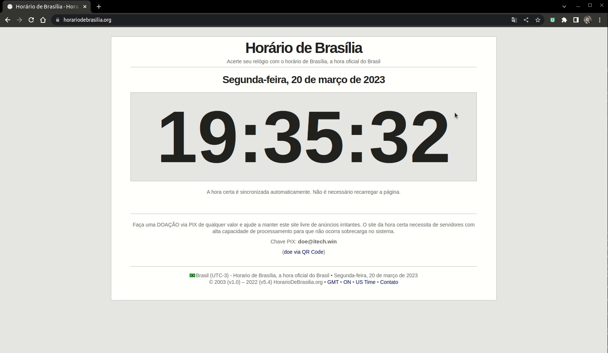

# Alarm-U chrome extension



This extension allows you to set alarms in chrome.

On alarm triggered shows a notification and open an alert, if has configured a URL will open a new tab with the provided link.

<br/>
## Production:

Build the application for production:

```bash
pnpm build:all
```

<br/>
## Development:

#### 1 - Install dependencies:
```
  pnpm install
```

#### 2.1 - Only layout
```
  pnpm dev
```


#### 2.2 - Test extension:
1. Env:
    - For load unpacked extension `pnpm build:all`
    - For load only src-extension `pnpm build:ext`
2. On Chrome, go to `Manage Extensions`;
3. Enable `Developer Mode`;
4. Click on `Load unpacked`;
5. Select `dist` folder generated from first step;